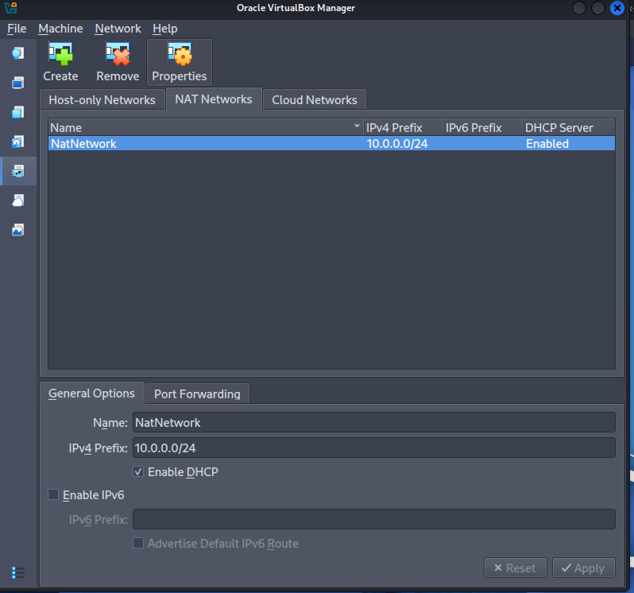
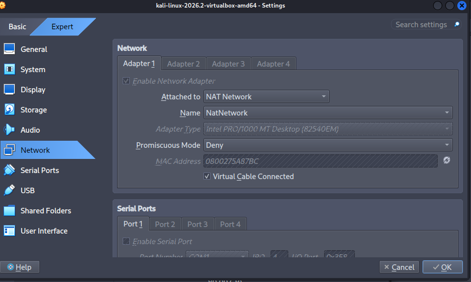
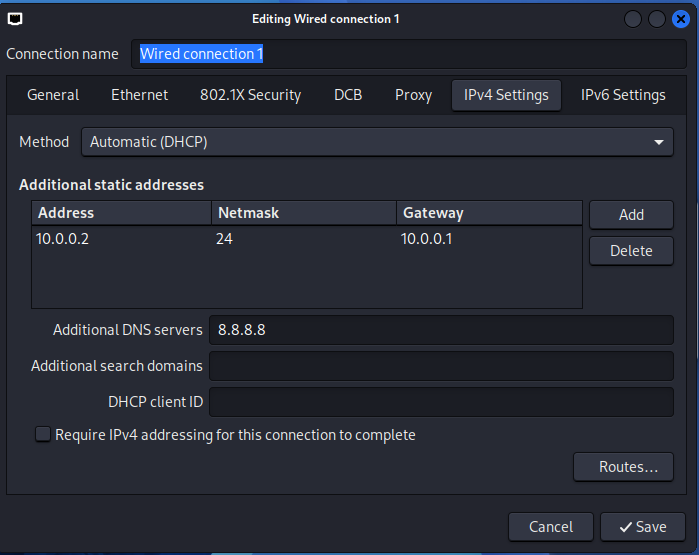
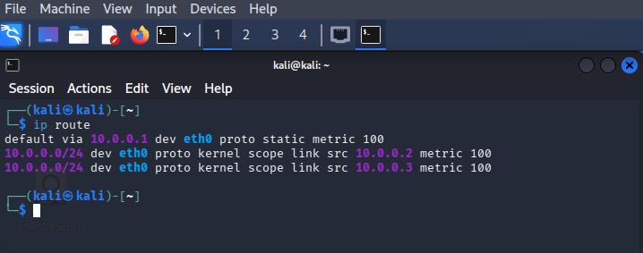
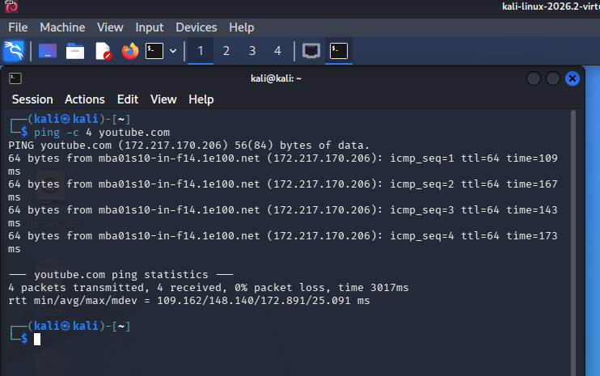
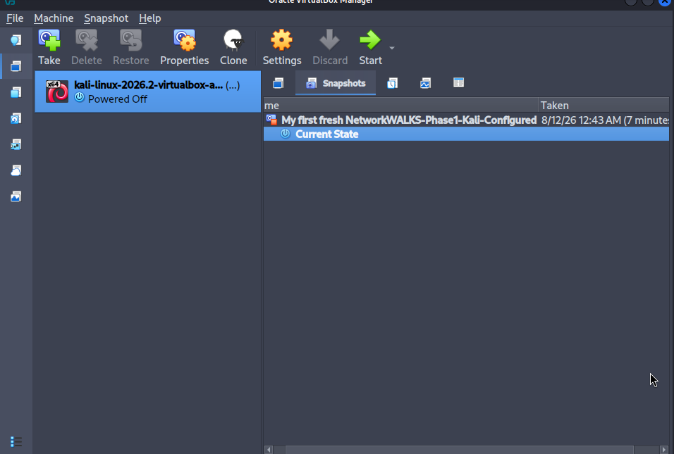

# NetworkWALKS Week 1 — Cybersecurity Lab Setup


## Overview

This project documents my **Week 1 cybersecurity laboratory environment setup** for the NetworkWALKS internship.

The lab environment was built using **VirtualBox and Kali Linux**, with a custom NAT Network configured using the `10.0.0.0/24` private IPv4 address range.

The purpose of this lab was to establish a controlled and repeatable environment for cybersecurity training, networking exercises, and future security testing.

---

## Objectives

The main objectives of this lab were to:

* Install and configure VirtualBox
* Create a custom NAT Network
* Deploy Kali Linux as a virtual machine
* Connect Kali Linux to the custom NAT Network
* Configure and verify the Kali Linux IPv4 address
* Test network connectivity
* Verify routing and gateway configuration
* Create a VirtualBox snapshot
* Document the complete laboratory setup
* Troubleshoot configuration and connectivity issues

---

## Tools & Technologies

| Tool / Technology      | Purpose                                |
| ---------------------- | -------------------------------------- |
| **Kali Linux**         | Cybersecurity operating system         |
| **VirtualBox**         | Virtualization platform                |
| **NAT Network**        | Virtual network connectivity           |
| **Linux `ip` command** | Network configuration and verification |
| **`ping`**             | Connectivity testing                   |
| **`ip route`**         | Routing table verification             |
| **Git & GitHub**       | Version control and documentation      |


---

## Lab Architecture

The laboratory network was configured using a private IPv4 network.

```text
                    Internet
                       │
                       │
                VirtualBox NAT
                       │
                 10.0.0.1
                    Gateway
                       │
              ┌────────┴────────┐
              │  NAT Network    │
              │  10.0.0.0/24    │
              └────────┬────────┘
                       │
                ┌──────┴──────┐
                │ Kali Linux  │
                │ 10.0.0.2/24│
                └─────────────┘
```

---

## Network Configuration

| Component       | Configuration      |
| --------------- | ------------------ |
| Virtualization  | VirtualBox         |
| Network Type    | Custom NAT Network |
| Network         | `10.0.0.0/24`      |
| Network Gateway | `10.0.0.1`         |
| Kali Linux      | Virtual Machine    |
| Kali IP Address | `10.0.0.2/24`      |

---

# Lab Implementation

## 1. Custom NAT Network

I created a custom VirtualBox NAT Network using the following network range:

```text
10.0.0.0/24
```

The gateway was configured as:

```text
10.0.0.1
```

### Configuration Screenshot



---

## 2. Kali Linux Virtual Machine

Kali Linux was deployed as a virtual machine inside VirtualBox.

The VM was configured to use the custom NAT Network created in the previous step.

### Virtual Machine Configuration



The Kali Linux VM was successfully connected to the custom network.

---

## 3. Kali Linux Network Configuration

The Kali Linux VM was configured with the following IPv4 address:

```text
10.0.0.2/24
```

I verified the network interface configuration using:

```bash
ip addr
```

### IP Address Verification



The output confirmed that Kali Linux had been assigned the expected `10.0.0.2/24` address.

---

## 4. Routing Configuration

I verified the routing table using:

```bash
ip route
```

The routing configuration was checked to ensure that traffic could be routed through the configured gateway.

### Routing Verification



---

## 5. Connectivity Testing

Network connectivity was tested using several commands.

### Gateway Test

```bash
ping -c 4 10.0.0.1
```

This test verified connectivity between Kali Linux and the configured gateway.

### Internet Connectivity Test

```bash
ping -c 4 google.com
```

This test was used to verify external network connectivity.

### Results

The connectivity tests were successful, confirming that the Kali Linux VM could communicate with the configured gateway and reach the internet.

### Connectivity Screenshot



---

## 6. VirtualBox Snapshot

After completing the configuration and connectivity verification, I created a VirtualBox snapshot of the configured Kali Linux environment.

The snapshot provides a restore point that can be used to return the virtual machine to its known working state.

### Snapshot



This is useful when performing future cybersecurity experiments because the VM can be restored if a configuration change breaks the environment.

---

# Troubleshooting & Errors Encountered

During the setup process, I encountered configuration and connectivity issues that required troubleshooting.

### Issue 1 — Network Configuration

The Kali Linux VM initially required verification to ensure that it was connected to the correct VirtualBox NAT Network.

**Resolution:**

* Checked the VirtualBox network adapter configuration
* Confirmed the selected NAT Network
* Verified the network interface inside Kali Linux
* Checked the assigned IPv4 address using `ip addr`

### Issue 2 — Connectivity Verification

Connectivity needed to be verified between the Kali VM, gateway, and external network.

**Resolution:**

I used:

```bash
ip addr
ip route
ping -c 4 10.0.0.1
ping -c 4 google.com
```

These commands helped identify whether the issue was related to the interface, routing, gateway, or external connectivity.

> **Note:** Replace the troubleshooting examples above with the exact errors you actually encountered during your lab. Accurate documentation is more valuable than making the README look perfect.

---

# Security Considerations

Although this lab is primarily focused on networking and virtualization, several security principles were applied.

* The environment uses a private IPv4 address range.
* Kali Linux is isolated inside a virtualized environment.
* The VM can be restored using a known-good snapshot.
* Network configuration was explicitly documented.
* Testing was performed within a controlled laboratory environment.

This setup provides a foundation for future cybersecurity labs involving network analysis, vulnerability assessment, and security testing.

---

# What I Learned

Through this laboratory exercise, I gained practical experience with:

* Virtual machine deployment
* VirtualBox configuration
* NAT networking
* IPv4 addressing
* Network interfaces
* Routing tables
* Default gateways
* Network connectivity testing
* Linux networking commands
* Network troubleshooting
* Virtual machine snapshots
* Technical documentation
* Cybersecurity laboratory management

---

# Commands Used

The following Linux commands were used during the lab:

```bash
ip addr
ip route
ping -c 4 10.0.0.1
ping -c 4 google.com
```

---

# Evidence & Documentation

Screenshots were captured during the major stages of the laboratory setup.

The evidence includes:

1. VirtualBox NAT Network configuration
2. Kali Linux VM configuration
3. Kali Linux IP configuration
4. Routing table
5. Connectivity tests
6. VirtualBox snapshot

These screenshots provide visual evidence of the completed configuration.

---

# Demonstration

A short video demonstration of the laboratory setup is available below:

**[▶ Watch the Lab Demonstration](lab_setup)**

The demonstration shows the main configuration steps, network verification, and completed Kali Linux environment.

---

# Project Structure

```text
NetworkWALKS-Week1/
│
├── README.md
│
├── screenshots/
│   ├── nat-network.png
│   ├── kali-vm.png
│   ├── ip-address.png
│   ├── ip-route.png
│   ├── ping-test.png
│   └── snapshot.png
│
└── demonstration/
    └── lab-demo.mp4
```

---

# Future Improvements

Possible improvements for future versions of the laboratory include:

* Add additional virtual machines
* Create a multi-machine virtual network
* Add an intentionally vulnerable machine
* Perform network traffic analysis
* Introduce Wireshark for packet analysis
* Configure a virtual firewall
* Practice vulnerability scanning in the isolated lab
* Document security testing methodologies
* Automate parts of the lab configuration

---

# Author

**Abubakar Issa Sabalah**

Cybersecurity Graduate | Cybersecurity Enthusiast | Digital Forensics

This laboratory was completed as part of my **NetworkWALKS internship training**.

---

# Conclusion

This lab provided practical experience in building and documenting a controlled cybersecurity practice environment using **VirtualBox and Kali Linux**.

The completed environment provides a foundation for future cybersecurity exercises involving networking, system administration, security testing, and digital forensics.

The exercise also reinforced the importance of **documentation, verification, troubleshooting, and reproducibility** when building technical laboratory environments.
